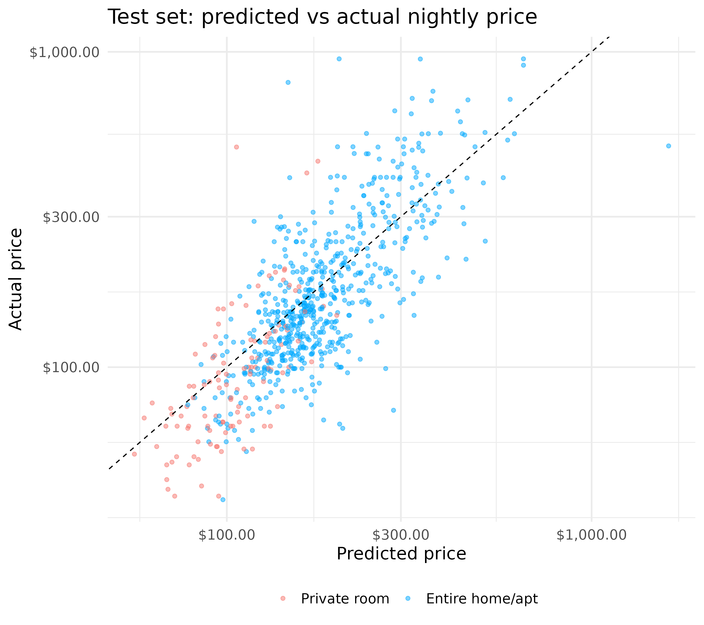
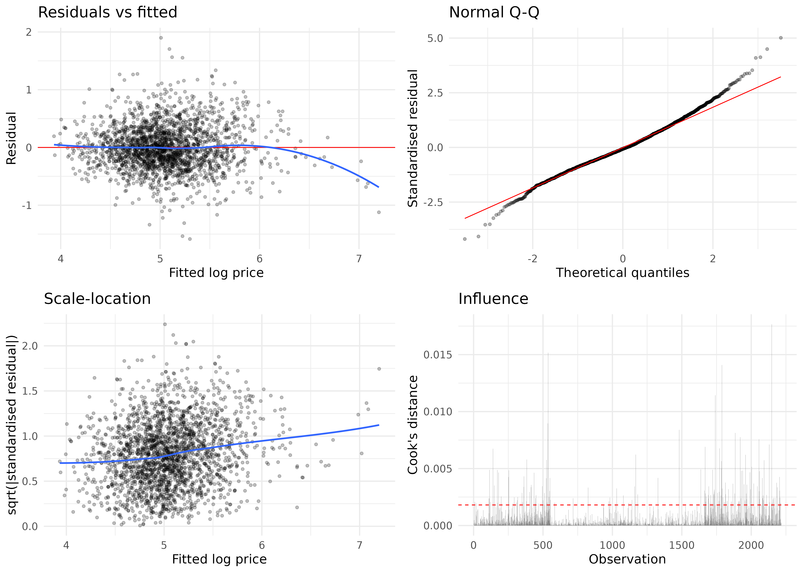

# What Drives Airbnb Prices in Vancouver?

A multiple linear regression on **log nightly price** for 2,955 active, short-term Airbnb listings in the City of Vancouver (Inside Airbnb, December 2023 snapshot), written in R.

The main question: holding other listing features fixed, how much more do **entire homes** cost than **private rooms**, and how much of a premium do **superhosts** charge?

## Results

| | |
|---|---|
| Listings (train / test) | 2,216 / 739 |
| Test R² (log price) | 0.61 |
| Test R² (dollars) | 0.44 |
| Test RMSE | $99.52 (median test price $147; median-price baseline RMSE $138.96) |
| Test median absolute error | $34.77 |
| Entire home vs private room | **+11.9%** adjusted (95% CI 5.3% to 18.8%); +74% unadjusted |
| Superhost vs not | **+6.6%** adjusted (95% CI 2.6% to 10.7%, HC3 robust) |

Most of the raw gap between entire homes and private rooms is explained by size: entire homes sleep more guests and have more, and private, bathrooms. Bathrooms, neighbourhood and host portfolio size are the strongest predictors by AIC.



## Methods

- **Cleaning:** entire homes and private rooms only; minimum stay under 30 nights; at least 3 reviews; price between $30 and $1,000. Bathroom count and shared/private bath parsed from text; distance to downtown (Waterfront Station) computed from coordinates.
- **Split:** 75/25 train/test, stratified on price, seed 8888.
- **Model selection:** bidirectional stepwise selection by AIC from a 13-predictor full model (all terms retained; see `drop1` table in the notebook).
- **Validation:** residuals vs fitted, normal Q-Q, scale-location and Cook's distance plots; generalised VIFs; HC3 heteroscedasticity-robust standard errors; robustness check dropping the most collinear term.
- **Prediction:** log-scale predictions back-transformed with Duan's smearing estimator.



## Repository layout

```
airbnb_price_regression.ipynb        full analysis (R kernel)
data/vancouver_listings_2023-12.csv  column subset of Inside Airbnb listings.csv
figures/                             plots saved by the notebook
archive/                             original DSCI 100 project (Paris, K-NN)
```

## Running it

Requires R with an IRkernel Jupyter kernel and these packages:

```r
install.packages(c("tidyverse", "rsample", "broom", "car", "gridExtra", "IRkernel"))
IRkernel::installspec()
```

Then open `airbnb_price_regression.ipynb` and run all cells, or:

```bash
jupyter nbconvert --to notebook --execute --inplace airbnb_price_regression.ipynb
```

## Data

[Inside Airbnb](http://insideairbnb.com/get-the-data/), Vancouver `listings.csv`, scraped 13–14 December 2023, licensed CC BY 4.0. The copy here keeps only the columns used in the analysis. It covers the City of Vancouver only, not the wider Lower Mainland yet.

## Limitations

Single snapshot; listed prices, not prices paid; results apply to active short-term listings; coefficients are associations, not causal effects; stepwise selection makes p-values descriptive rather than confirmatory.
